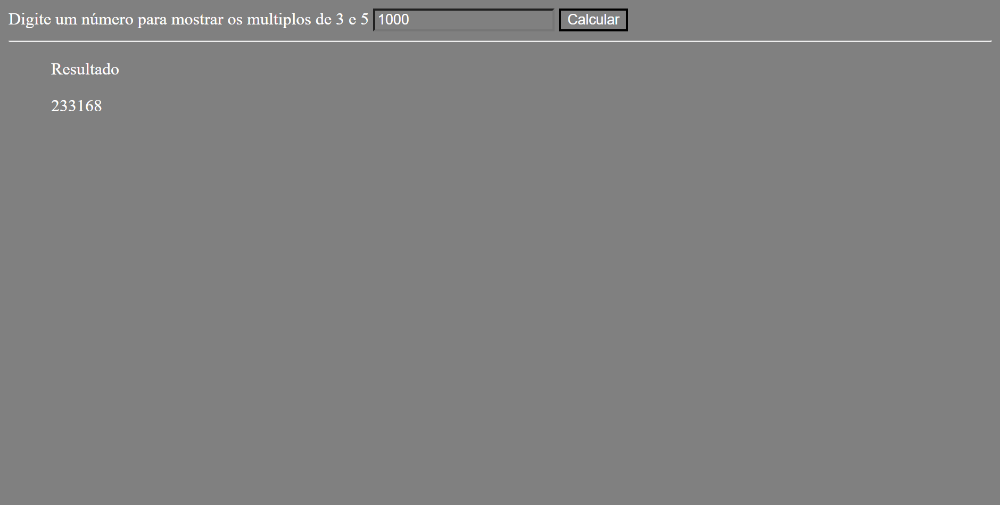
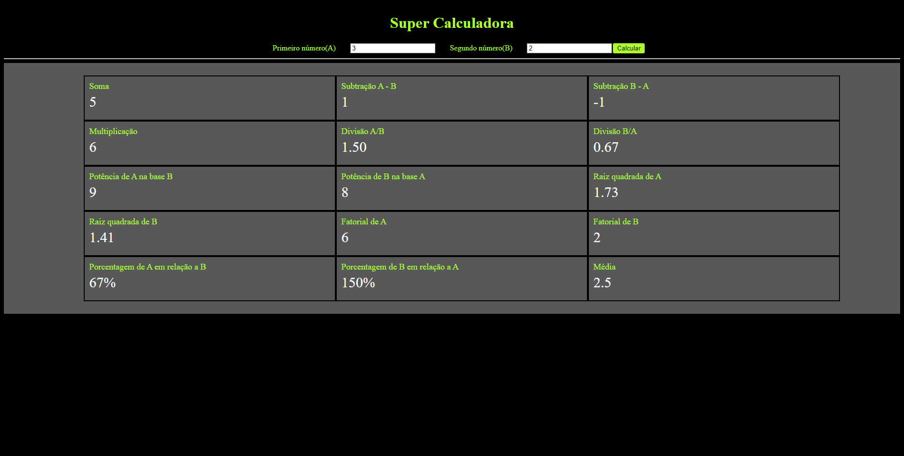

# Repositório de estudos para o minicamp da XPEducação

- [ ] Módulo 1 - Introdução à lógica de programação
- [ ] Módulo 2 - Introdução à programação web

## Objetivos
- Módulo 1: Exercitar os conceitos de *Programação em JavaScript*
- Módulo 2: Exercitar os conceitos de *Implementação de aplicações com HTML, CSS, JavaScript e Manipulação da DOM com JavaScript*

## Testes práticos
- Módulo 1: Mostrar a soma de todos os números múltiplos de 3 e 5
- Módulo 2: Criar uma super calculadora capaz de fazer os seguintes cálculos a partir de dois números: *Soma, Subtração, Divisão, Multiplicação, Potência, Raiz quadrada, Fatorial, Porcentagem, Média.*

## Exemplos dos testes

### Múltiplos de 3 e 5

### Super Calculadora

